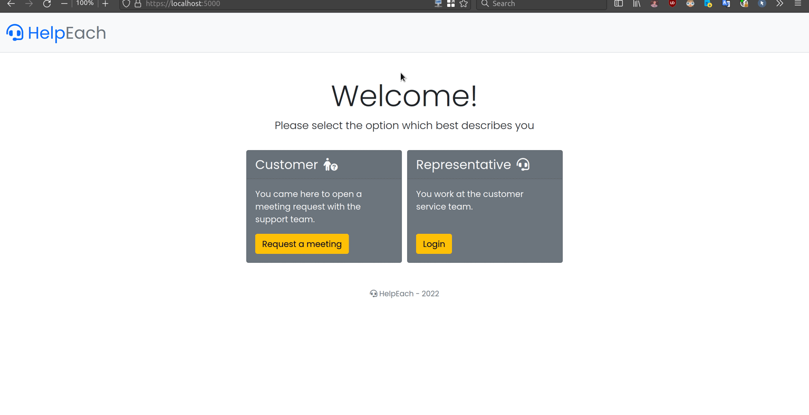
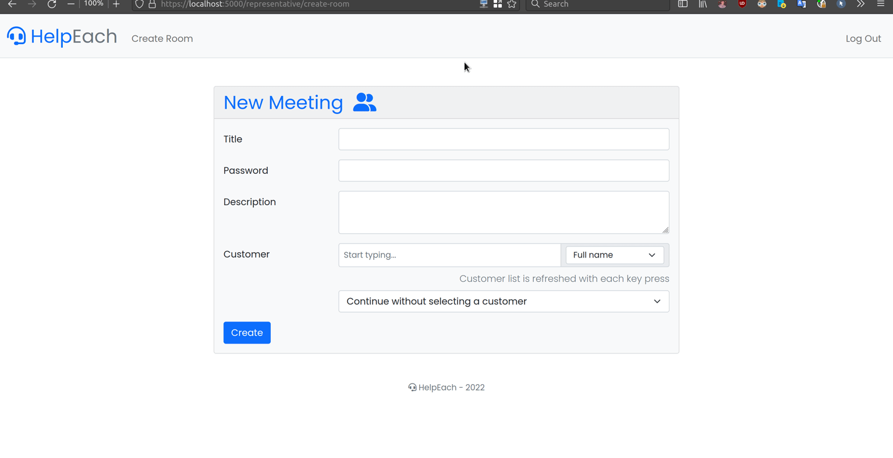
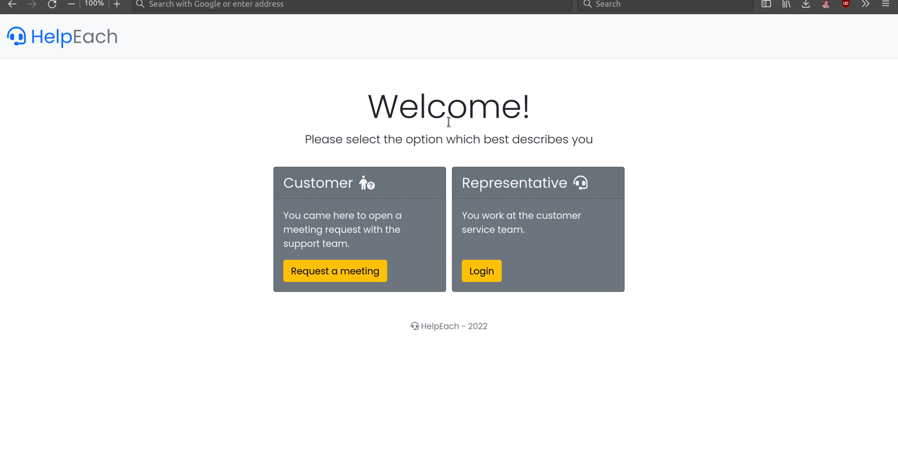
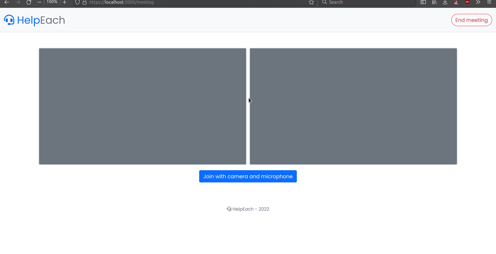

# WebRTC Customer Service

We aim to provide free and open-source web video chat application to be used in the customer service domain.

<!-- START doctoc generated TOC please keep comment here to allow auto update -->
<!-- DON'T EDIT THIS SECTION, INSTEAD RE-RUN doctoc TO UPDATE -->
## Contents

- [About](#about)
- [Requirements](#requirements)
- [Running Server Locally](#running-server-locally)
  - [Deploying to Production](#deploying-to-production)
- [Routes](#routes)
- [Features](#features)
- [Technologies](#technologies)
- [License](#license)
- [Contributors](#contributors)

<!-- END doctoc generated TOC please keep comment here to allow auto update -->

## About

This project is designed as a video call and customer service management system that can be used by companies that want to provide video support services to their existing customers or external customers. It is foreseen that it will be a good alternative to the existing video calling platforms, as it is free, modern, minimal, fast and is in the hands of the service provider company. It also includes features not found on platforms designed for general use. For example, the company using the application can control the customer representatives through the kept call logs. Customers can file video support requests to customer representatives without an intermediary. Thus, the action time of customer representatives is reduced and customer satisfaction is increased.

## Requirements

* Python 3
* Pip 3

## Running Server Locally

1. Install Python dependencies.
    ```sh
    pip3 install -r requirements.txt
    ```
1. Install Python PostgreSQL driver [psycopg2](https://www.psycopg.org/docs/install.html#quick-install).

    1. Build prerequisites (installation shown for Ubuntu derivatives)\
        **Note**: Update apt cache first with `sudo apt update`.
        1. A C compiler
            ```sh
            sudo apt install gcc
            ```
        1. python3-dev system package
            ```sh
            sudo apt install python3-dev
            ```
        1. libpq-dev system package
            ```sh
            sudo apt install libpq-dev
            ```
        1. PostgreSQL server
            ```sh
            sudo apt install postgresql postgresql-contrib
            ```
    2. Build from source.

        ```sh
        pip3 install psycopg2
        ```
1. After this step you need a working PostgreSQL server.
    ```sh
    # Linux derivatives
    sudo service postgresql start
    ```
1. You must write PostgreSQL connection parameters to the `instance/config.py` file. You should create the file if it does not exist. A sample config is given below:
    ```sh
    # PostgreSQL sample values
    DB_HOST = "localhost"
    DB_PORT = "5432"
    DB_NAME = "webrtc_customer_service"
    DB_USER = "postgres"
    DB_PASSWORD = ""
    ```

1. Initiate the PostgreSQL database with Flask CLI command.
    ```sh
    flask init-db
    ```
1. **[OPTIONAL]** Insert mock data to database for test purposes. All mock passwords are `1234`.
    ```sh
    flask import-mock-data
    ```
1. Define OS environment variables.
    ```sh
    # Activate Flask debugger
    export FLASK_ENV=development

    # Choose HTTPS mode
    export HTTPS_MODE="adhoc"
    # "adhoc": create random certificate with each run
    # Other options are "self-signed" and "none"
    # If you choose "self-signed" you must have SSL certificate files
    # ready in the certificate/ directory
    ```
1. Start the Flask development server.
    ```sh
    python app.py
    ```
1. Access the application from browser
    ```sh
    https://localhost:5000
    ```

### Deploying to Production

This Flask Werkzeug server is for development only. Check [Flask docs deploying section](https://flask.palletsprojects.com/en/2.1.x/deploying/) to learn how to deploy WSGI server to production. If you want to use additional HTTP server as a reverse proxy than you must declare that in the `app/init.py`. How to do that is explained in [proxy fix subsection](https://flask.palletsprojects.com/en/2.1.x/deploying/proxy_fix/).

## Routes

There are customer only, representative only and general routes in the application. Users can access different interfaces of the app by using the routes explained below. User authentication information are stored as sessions in the database using signed cookies. Unauthenticated access requests to routes are denied.

| Route | Description | Methods |
|:---:|---|:---:|
| /auth/register | Interface where user creates an account. | GET, POST |
| /auth/login | Interface where user enters the application with his account. | GET, POST |
| /auth/logout | Logouts from the user's account and clears the session. | GET |
| /representative/create-room | Interface where customer representatives create meeting rooms. | GET, POST |
| /representative/get-customers | Returns matching customers as JSON list according to GET parameters. | GET |
| / | Welcome page | GET |
| /join-meeting/\<int:id\> | Interface where customers join the meeting by entering information. | GET, POST |
| /request-meeting | Interface where customers file a video call request. | GET, POST |
| /leave-meeting | Ends the meeting. | GET |
| /meeting | Interface where the meeting happens. | GET, POST |

## Features

* Customer representatives can create an account and log in.
    

* Customer representatives can create a meeting room. 
 
    There are two types of meeting rooms. If representative selects the customer from customer database while creating the room, then meeting room is assigned to that customer only. Otherwise general meeting room is created. 
    

* Customers can join a meeting by following the invite link. 

    User interface differs between customer and guest customer. Customers enter phone number and room password. Guest customers enter contact info and room password. Guest customers are stored in a seperate table than customers.
    

* One to one live meeting between customer and representative.
    

## Technologies

* [Python Flask](https://flask.palletsprojects.com/en/2.1.x/quickstart/) back-end
* [Jinja2](https://jinja.palletsprojects.com/en/3.1.x/templates/) template engine for Flask
* HTML, CSS, JS front-end
* [Bootstrap 5.1](https://getbootstrap.com/docs/5.1/getting-started/introduction/) CSS framework
* [Socket.io](https://socket.io/docs/v4/client-api/) JS client API and [flask-socketio](https://flask-socketio.readthedocs.io/en/latest/getting_started.html) library
* [PostgreSQL](https://www.postgresql.org/about/) database
* [Font Awesome 6.1](https://fontawesome.com/start) icon pack

## License

WebRTC Customer Service is free software published under the MIT license. See [LICENSE](LICENSE) for details.

## Contributors

* [Erkan Vatan](https://github.com/arensonzz)
* [Ozan Kukul](https://github.com/ozankukul)

